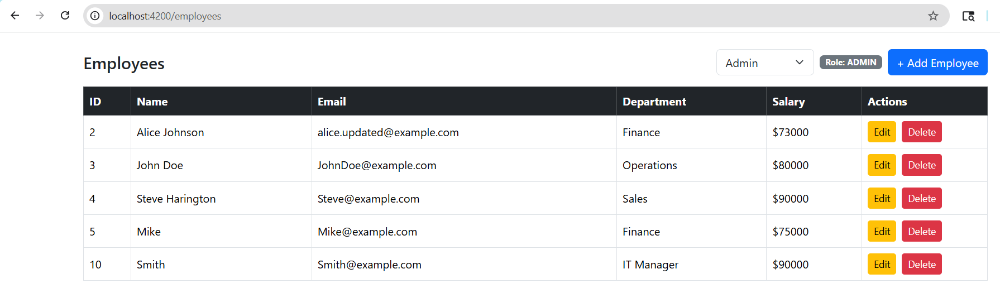
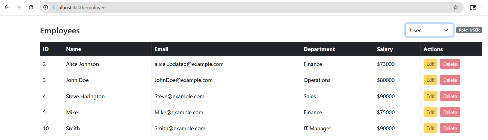
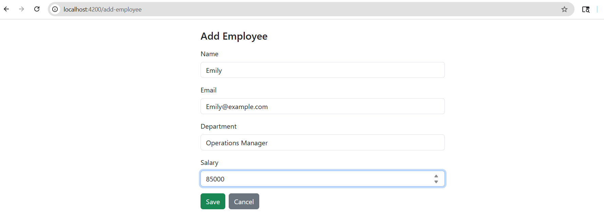
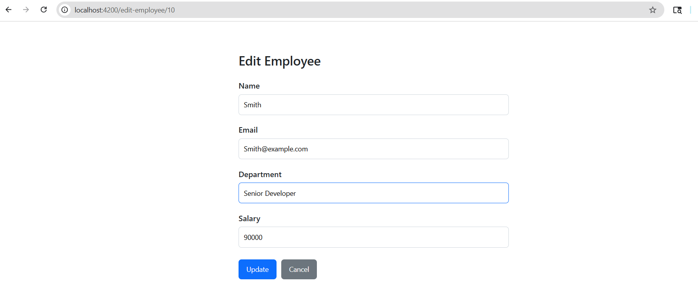

# HRMS Frontend (Angular)

Frontend application for a Human Resource Management System (HRMS) that enables role-based employee management through a clean and responsive user interface.

## Overview
This Angular application serves as the frontend for a full-stack HRMS platform, allowing administrators to manage employee data and users to view employee information through secure, role-based access.

## Tech Stack
- Angular
- TypeScript
- Bootstrap
- RESTful APIs
- Git & GitHub

## Features
- Role-based UI access (Admin / User)
- Employee Create, Read, Update, Delete (CRUD) operations
- Route protection using Angular Guards
- Responsive UI using Bootstrap
- Integration with Spring Boot backend APIs

## User Roles
- **Admin**
  - Add new employees
  - Edit employee details
  - Delete employee records
- **User**
  - View employee information

## Screenshots
### Admin Role (Actions Enabled)


### User Role (Actions Disabled)


### Add Employee


### Edit Employee



## Architecture
Angular UI
↓
Spring Boot REST APIs
↓
MySQL Database


## How to Run Locally
1. Clone the repository  
2. Install dependencies  
   ```bash
   npm install
   
3. Start the application
ng serve

4. Open in browser
http://localhost:4200

## Backend Repository
https://github.com/Tejaswini0506/hrms-backend
